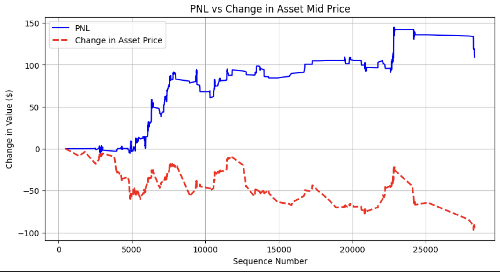

# Machine Learning Paper Trading Simulator
## About
This repo is a paper simulator to test the live performance of machine learning binary classifiers for choosing when to buy and sell stocks, cryptocurrencies, and other tradeable assets. This simulator is connected to the Coinbase exchange, but in theory, can be applied to any exchange and any asset class. You can plug and play any machine learning binary classifier to see its performance. The binary classifier should be trained to predict when the mid price will go up and when it will go down, and the simulator will show how accurately it will be able to do so. NOTE: This simulator should not be used to test PnL performance because this simulator does not account for volume of orders on the orderbook; the Advanced version on my repo page does this; this simulator only shows how accurately the binary classifier can predict price movement.

## Workflow
### Connecting to Exchange
The simulation starts with reading in exchange data through websocket.py. Each exchange has different websocket APIs; currently, websocket.py is configured to read in data from Coinbase exchange. You have to provide your own API name and secret key to connect to each exchange. After the keys are plugged in, the websocket will continually read in updates and place each update into the `WebSocket.ws_updates_queue`, which is also accessible by `Simulator`.

### Updating Orderbook
After the `WebSocket` places each update on `WebSocket.ws_updates_queue`, the `Simulator` processes each update from `Simulator.websocket_updates_queue` in `Simulator.process_msg(msg)`, where `msg` is an orderbook update. In `Simulator.process_msg(msg)`, the function calls `OrderBook.process_updates(updates)`, which updates `OrderBook`. `OrderBook` contains real-time orderbook data from whichever exchange and asset `WebSocket` is connected to.

### Selling Positions
After the orderbook is updated, we check if any of our active positions have reached their sell time. All active positions are held in `Simulator.exposure`, which is made up of `Trade`. If 
`Trade.sell_sequence_number <= sequence_number`, then the current `Trade` is ready to sell. If a `Trade` is ready to sell, we pop it from `Simulator.exposure`, update `Simulator.pnl`, and place the `Trade` on `Simulator.completed_trades_queue`. This queue writes to a csv file of all the trades of the simulation.

### Machine Learning Price Movement Prediction and Buying Positions
After expired active positions are sold, we check if the current state of the orderbook might lead to an increase or decrease in mid price. We call `Simulator.binary_classifier.create_inference_vector(bids, asks, timestamp_str)`. This function returns a boolean, `1` means price will go up. If `1`, we place an active `Trade` position into `Simulator.exposure`. 

## Machine Learning & QR
All of the machine learning exists within `model.py` and `research.ipynb`. Feature engineering and model training is done in `research.ipynb`. Then, the model is imported into `model.py` and the feature engineering code for the inference vector is in `model.py`. Whenever a new model is plugged into `model.py`, we also have to change the code under `BinaryClassifier.create_inference_vector(bids, asks, timestamp_str)`, to reflect the appropriate inference vector for a new binary classifier.

### Personal Research and Outcomes
Research can by found in `research.ipynb`. The feature vectors are engineered by looking at the top 10 price levels of each update (each unique sequence number) of the bitcoin orderbook on Coinbase. The feature engineering happens within `time_independent_features(df, price_level_num = 10)` and 
`time_dependent_feature(df, windows)`. The target vector is engineered by shifting the "Mid Price" of each row up by 3. So, for each feature vector, it will have a "Mid Price Time Lag 3" that points to the expected future price in the next three updates. If "Mid Price" < "Mid Price Time Lag 3" for each row, then 1 else 0 for the target vector "Gain". The target vector engineering happens in `create_time_lag(df, sell_column, time_lag)` and `create_gain_binary(df, buy_column, sell_column, time_lag)`. After the training dataset is complete, we train the machine learning model. I found that XGBoost models perform well. And it is important to note, that I do use all columns I feature engineered. The feature vector can be found in `feature_columns`. Before training, we see the breakdown of `0`s and `1`s in the target vector for all the rows. Since there is an imbalance (3x the `0`s as there are `1`s), it is important to resample the training dataset so that there is a more balanced representation of `0`s and `1` target vectors and their corresponding feature vectors. Then, I split the training dataset into `X_train, X_test, y_train, y_test` and train the XGBoost model. After training, we take `X_test` and find the `y_probs`, which contains the probability of each datapoint in `X_test` resulting in a positive price movement in the next three updates. I find the probabilities when `y_test==1` (when the inference vector in `X_test` does point to a positive increase in a future price) and graph them in `graph_probabilities_of_increase()`. Then, I find the probabilities when `y_test==0` (when the inference vector in `X_test` points to a decrease in a future price) and graph them in `graph_probabilities_of_decrease()`. Eyeing the two graphs, I thought a probaility limit of 0.8 was appropriate because there are fewer datapoints where `y_test==0` compared to `y_test==1` above 0.8. In a sitation like this, the false positives are incredibly important. The number of false positives are events where we buy believing it will go up, but the price goes down and we sell at a loss. We want to minimize false positives as much as possible. False negatives and true negatives are irrelevent because we do not act when we believe the price will decrease (there is no shorting in this simulation). Our profit comes from true positives. While # true positives > # false positives, we should have a positive PnL. I simulated my model for 30 minutes, and from its performance, the model is accurate in picking when to buy and sell.

simulation_1_3_update_lag_xgbclassifier2

THIS DOES NOT MEAN YOU WILL MAKE $100 IN 30 MINUTES. We do not account for volume of asks and bids in this simulation. This simulation simply points that the model you are testing, on average, is able to correctly price movement.